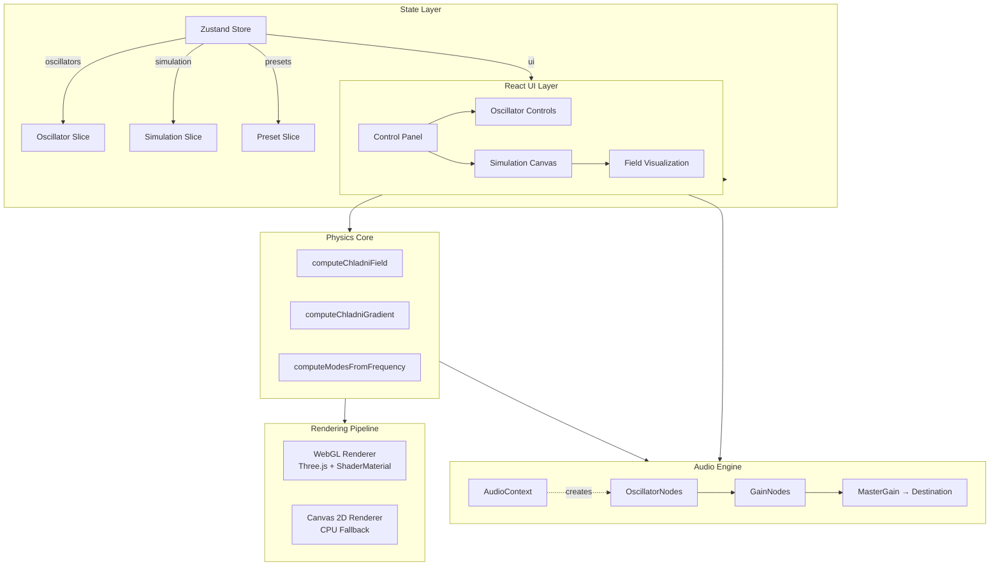
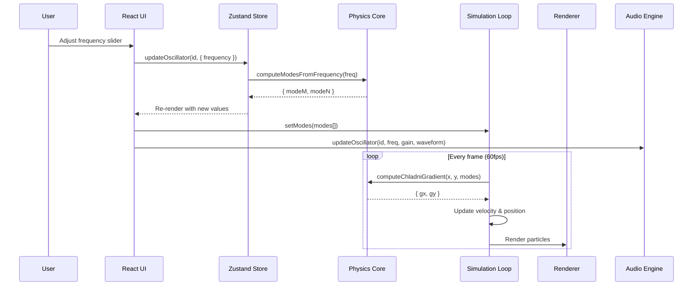
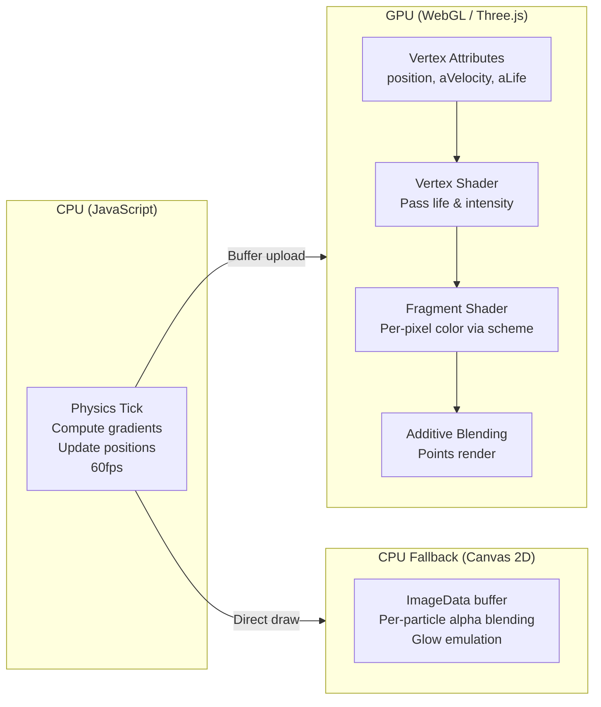
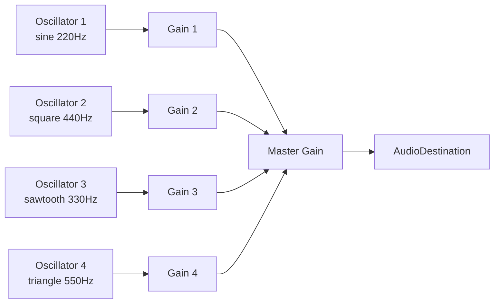
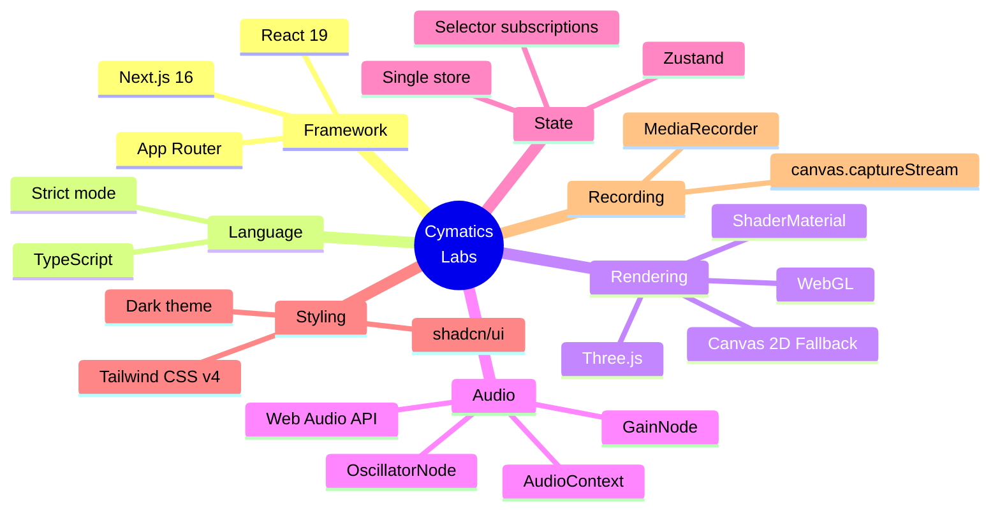

# Cymatics Labs

An interactive, real-time **cymatic pattern simulator** — making sound visible through GPU-accelerated particle physics. Explore standing wave patterns, multi-oscillator interference, and 35+ built-in presets. Built with Next.js, Three.js, and the Web Audio API.

## Historical Background

> *"I observed that when a brass plate is made to sound, the sand upon it arranges itself in various figures, whose forms depend on the nature of the vibrations."*
> — **Ernst Florens Friedrich Chladni** (1756–1827)

German physicist and musician **Ernst Chladni** first documented these patterns in his 1787 treatise *"Entdeckungen über die Theorie des Klanges"* (Discoveries Concerning the Theory of Sound). By drawing a violin bow across the edge of a brass plate covered with fine sand, he demonstrated that sound could produce visible, geometric forms — effectively making sound "visible." His work laid the foundation for modern acoustics and influenced Napoleon Bonaparte to offer a prize (won by Sophie Germain) for a mathematical explanation of the patterns.

Today, Chladni patterns remain a compelling intersection of physics, mathematics, and art — revealing the elegant modal structures hidden within everyday vibration.

## What Is Cymatics?

**Cymatics** (from Greek *κῦμα*, "wave") is the study of visible sound and vibration. It sits at the intersection of physics, biology, and art — revealing how oscillatory fields organize matter into geometric forms.

While **Chladni figures** are the most famous example (sand on a vibrating plate), cymatic patterns appear across nature: **Faraday waves** on a liquid surface, **Lissajous figures** from coupled pendulums, the **ripple tank** in classrooms, **granular segregation** in industrial sorting, and even the **cochlear travelling wave** in the human inner ear.

The term *cymatics* was coined by Swiss physician and natural scientist **Hans Jenny** (1904–1972) in his 1967 book *Kymatic* (later *Cymatics*). Jenny systematically photographed hundreds of patterns created by vibrating powders, fluids, and pastes on steel plates — extending Chladni's work into a broader study of how frequency, amplitude, and waveform shape organize matter.

Today, cymatics informs fields as diverse as **acoustic levitation**, **ultrasonic cleaning**, **musical instrument design**, and **generative visual art** — making Cymatics Labs a direct digital continuation of a 230-year-old tradition.

## Features

- **Real-time particle simulation** — GPU-accelerated WebGL rendering via Three.js (up to 200k particles) with automatic Canvas 2D CPU fallback
- **Multi-oscillator audio engine** — Independent sine/square/sawtooth/triangle oscillators with per-oscillator frequency, amplitude, detune, and waveform controls
- **Frequency-driven mode mapping** — Mode numbers (m, n) are automatically derived from frequency: `m = round(√(f/220) × 3)`, `n = round(√(f/220) × 5)`, coupling pitch to pattern complexity
- **35 built-in presets** — Sacred Geometry & Yantra (10), Sonic & Harmonic (10), Classical Chladni (5), Complex & Symmetric (10)
- **6 color schemes** — Classic Sand, Rainbow, Heat Map, Ocean, Neon, Custom
- **Field visualization overlay** — Display the computed |z|² intensity field in real-time
- **Zoom & pan** — Scroll-wheel zoom (always active), toggleable drag-to-pan
- **Video recording** — Capture canvas to WebM via `MediaRecorder` + `captureStream`
- **Export / Import** — Save and load full configurations as JSON
- **Resizable sidebar** — Drag the control panel edge to resize (280–600px)
- **Keyboard shortcuts** — Full keyboard control (Space, R, H, V, 1-4)
- **Dark theme** — Polished zinc/emerald UI with Tailwind CSS v4

## The Physics

### Chladni's Equation

For a square plate clamped at its center, the vertical displacement at position (x, y) for a given mode (m, n) is:

$$z(x, y) = \cos\left(\frac{m\pi x}{L}\right) \cdot \cos\left(\frac{n\pi y}{L}\right) - \cos\left(\frac{n\pi x}{L}\right) \cdot \cos\left(\frac{m\pi y}{L}\right)$$

where:
- **m**, **n** — positive integer mode numbers
- **L** — plate half-size

This is a solution to the **Helmholtz wave equation** $\nabla^2 z + k^2 z = 0$ for a thin square plate with free edges and a clamped center.

### Gradient-Driven Particle Motion

Particles are driven by the gradient of the field intensity $|z|^2$, computed analytically (not numerically) for stable, high-performance simulation:

$$F(x, y) = -\nabla|z(x, y)|^2, \quad F_x = -\frac{\partial|z|^2}{\partial x}, \quad F_y = -\frac{\partial|z|^2}{\partial y}$$

The analytic partial derivative:

$$\frac{\partial z}{\partial x} = -\frac{m\pi}{L}\sin\left(\frac{m\pi x}{L}\right)\cos\left(\frac{n\pi y}{L}\right) + \frac{n\pi}{L}\sin\left(\frac{n\pi x}{L}\right)\cos\left(\frac{m\pi y}{L}\right)$$

Particles accumulate at **nodal lines** (where $z = 0$) because the gradient force pushes them away from anti-nodes (regions of maximum vibration) and toward stationary regions.

### Multi-Oscillator Superposition

With multiple active oscillators, fields superpose linearly:

$$Z(x, y) = \sum_i A_i \cdot \left[\cos\left(\frac{m_i \pi x}{L}\right)\cos\left(\frac{n_i \pi y}{L}\right) - \cos\left(\frac{n_i \pi x}{L}\right)\cos\left(\frac{m_i \pi y}{L}\right)\right]$$

Each oscillator $i$ contributes its standing wave weighted by amplitude $A_i$.

## Architecture

### System Overview



### Data Flow



### Rendering Pipeline



### Audio Signal Flow



## Controls

### Simulation Transport

| Control | Action |
|---------|--------|
| **Start / Stop** | Toggle particle simulation & audio |
| **Record Video** | Capture canvas to `.webm` (only when playing) |
| **Reset Defaults** | Restore initial state |

### Interactive Canvas

| Mode | Behavior |
|------|----------|
| **Zoom (default)** | Scroll wheel zooms in/out toward cursor. Infinite zoom range. |
| **Pan** (toggle) | Click and drag to pan. Cursor changes to grab/grabbing. |

### Keyboard Shortcuts

| Key | Action |
|-----|--------|
| `Space` | Play / Pause |
| `Shift+O` | Add oscillator |
| `R` | Reset particles |
| `H` | Toggle panel |
| `V` | Toggle field overlay |
| `1` – `4` | Toggle oscillator 1–4 |

### Presets

The simulator includes **35 hand-crafted presets** in four categories:

| Category | Count | Description |
|----------|-------|-------------|
| Sacred Geometry & Yantra | 10 | Sri Yantra, Mandala, Lotus, Om, Chakra motifs via complementary mode pairs |
| Sonic & Harmonic | 10 | Musical intervals (octaves, fifths, triads) and harmonic series ratios |
| Classical Chladni | 5 | Pure single-mode patterns: (1,1), (2,2), (3,3), (2,3), (3,5) |
| Complex & Symmetric | 10 | Multi-oscillator interference: Cosmic Web, Crystal Lattice, Stellar Nebula |

## Tech Stack



## Getting Started

### Prerequisites

- Node.js ≥ 22
- [bun](https://bun.sh) (or npm/pnpm)

### Installation

```bash
# Install dependencies
bun install

# Run development server
bun run dev

# Build for production
bun run build

# Start production server
bun run start
```

Open [http://localhost:3000](http://localhost:3000) in your browser.

## Project Structure

```
src/
├── app/                              # Next.js App Router
│   ├── page.tsx                      # Main page: layout, header, canvas, sidebar
│   ├── layout.tsx                    # Root layout (dark theme, Geist font)
│   └── globals.css                   # Tailwind v4 theme, custom scrollbar
├── components/
│   ├── chladni-simulation-canvas.tsx  # Canvas wrapper with WebGL/CPU auto-detection
│   ├── control-panel.tsx             # Sidebar: all controls in collapsible sections
│   ├── oscillator-control.tsx        # Per-oscillator card (frequency, amplitude, waveform)
│   ├── field-visualization.tsx       # Semi-transparent |z|² overlay
│   └── ui/                           # shadcn/ui primitives
├── lib/
│   ├── chladni-physics.ts            # Types, physics math, 35 presets
│   ├── chladni-simulation.ts         # Three.js WebGL GPU simulation
│   ├── chladni-simulation-cpu.ts     # Canvas 2D CPU fallback
│   ├── audio-engine.ts               # Web Audio API engine with deferred init
│   ├── chladni-store.ts              # Zustand store (oscillators, simulation, presets)
│   └── utils.ts                      # Tailwind merge utility
└── hooks/
    └── use-keyboard-shortcuts.ts     # Global keyboard shortcut handler
```

## License

MIT
